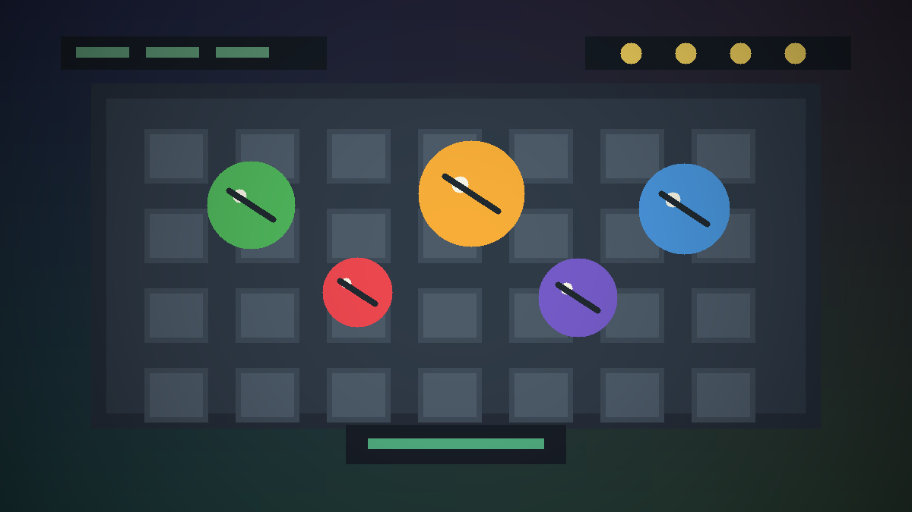
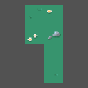

# Unity Game Portfolio

Unity와 C#으로 만든 2D 게임 결과물을 Windows 실행 빌드와 구현 문서로 정리한 포트폴리오입니다.


## Problem

- Unity 프로젝트는 시간이 지나면 빌드 파일, Unity package, 에셋, 문서가 섞이기 쉽습니다.
- GitHub 언어 통계에는 Unity가 아니라 C# 중심으로 표시되기 때문에 게임 개발 경험을 README에서 명확히 설명해야 합니다.
- 실행 가능한 결과물과 구현 포인트를 분리해 보여줄 필요가 있습니다.

## Solution

- 게임별 폴더를 분리했습니다.
- Windows 실행 빌드와 상세 문서를 함께 제공합니다.
- `VamGame`은 Unity package와 구현 포인트를 문서화했습니다.
- `subakgame`은 보관된 Windows 실행 빌드 중심으로 정리했습니다.

## Tech Stack

| Area | Stack |
| --- | --- |
| Engine | Unity |
| Language | C# |
| Build target | Windows |
| Game type | 2D action, survival, casual game |
| Documentation | Markdown |

## Skills

- Unity C# 2D 게임 개발
- 플레이어 이동과 생존 처리
- 적 스폰과 추적
- 무기와 총알 처리
- 아이템 및 장비 시스템
- 레벨업과 HUD 구성
- 오브젝트 풀링 기반 생성 관리
- Windows 실행 빌드 정리
- 게임별 README와 문서 작성

## Project Gallery

| VamGame | subakgame |
| --- | --- |
|  |  |
| 2D 생존 액션 게임 | Windows 실행 빌드 |
| [상세 문서](docs/vamgame.md) | [상세 문서](docs/subakgame.md) |

## Included Projects

| Project | Genre | Build | Detail | Main Points |
| --- | --- | --- | --- | --- |
| VamGame | 2D action survival | `games/vamgame/Build/VamGame/vam.exe` | [docs/vamgame.md](docs/vamgame.md) | 플레이어 성장, 적 스폰, 무기/아이템, 오브젝트 풀링 |
| subakgame | Casual game build | `games/subakgame/Build/subakgame/subakgame.exe` | [docs/subakgame.md](docs/subakgame.md) | Unity Windows 실행 빌드 |

## Run

Windows에서 각 게임 폴더의 실행 파일을 실행합니다.

```text
games/vamgame/Build/VamGame/vam.exe
games/subakgame/Build/subakgame/subakgame.exe
```

## Project Structure

```text
unity-game-portfolio/
├── games/
│   ├── vamgame/
│   │   ├── README.md
│   │   ├── VamGame.unitypackage
│   │   └── Build/VamGame/
│   └── subakgame/
│       ├── README.md
│       └── Build/subakgame/
├── docs/
│   ├── assets/
│   ├── vamgame.md
│   └── subakgame.md
├── .gitignore
└── README.md
```

## VamGame Implementation Points

- 플레이어 이동과 생존 처리
- 적 생성과 추적
- 무기와 총알 처리
- 아이템 및 장비 시스템
- 레벨업과 HUD
- 오브젝트 풀링 기반 생성 관리

## Assets Preview

| Enemy | Bullet | Tile Palette |
| --- | --- | --- |
|  |  |  |
