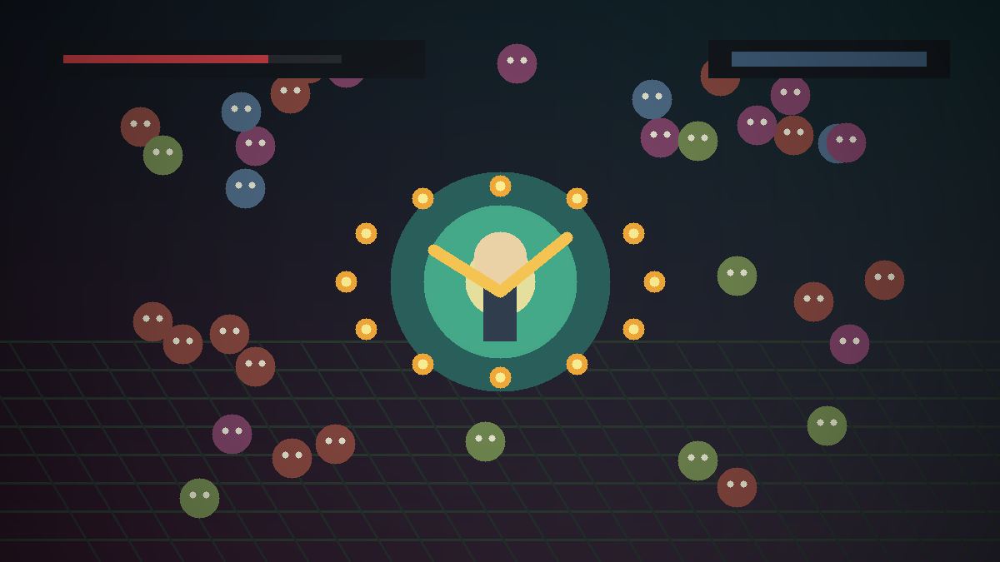
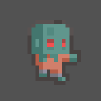
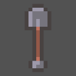
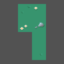

# Unity Game Portfolio

Unity와 C#으로 제작한 2D 게임 두 개를 Windows 실행 빌드, Unity package, 구현 문서와 함께 정리한 저장소입니다.



## Included Games / 포함 게임

| 게임 | 형태 | 구현 내용 | 실행 파일 |
| --- | --- | --- | --- |
| VamGame | 2D 생존 액션 | 플레이어 이동, 적 추적·스폰, 무기·총알, 아이템, 레벨업, HUD, object pooling | [Windows ZIP](https://github.com/jiyoon99/unity-game-portfolio/releases/download/builds-2026.06/vamgame-windows.zip) |
| subakgame | 캐주얼 게임 | Windows 실행 빌드와 프로젝트 설명 자료 | [Windows ZIP](https://github.com/jiyoon99/unity-game-portfolio/releases/download/builds-2026.06/subakgame-windows.zip) |

| VamGame | subakgame |
| --- | --- |
|  |  |
| [상세 문서](docs/vamgame.md) | [상세 문서](docs/subakgame.md) |

## VamGame Features / VamGame 기능

- 키보드 입력 기반 플레이어 이동과 생존 상태 처리
- 플레이어 위치를 기준으로 한 적 추적과 단계별 스폰
- 무기별 공격 주기와 총알 생성·이동·충돌 처리
- 경험치 아이템 획득과 레벨업 선택 흐름
- 장비와 능력치가 전투에 반영되는 성장 구조
- 체력, 경험치, 레벨, 시간을 표시하는 HUD
- 반복 생성되는 적과 투사체를 위한 object pooling
- 타일맵과 prefab을 사용한 2D 맵·오브젝트 구성

## Development / 개발 방식

게임 동작을 플레이어, 적, 무기, 투사체, 아이템, 게임 관리 영역으로 나누고 Unity component lifecycle에 맞춰 연결했습니다.

```text
Input
  ↓
Player movement and state
  ↓
Enemy spawn and tracking
  ↓
Weapon / projectile collision
  ↓
Item pickup and level progression
  ↓
HUD update
```

빈번하게 생성·삭제되는 적과 투사체는 object pool에서 재사용하도록 구성했습니다. 실행 가능한 Windows 빌드는 GitHub Release로 분리하고, 재사용 가능한 VamGame 프로젝트 내용은 `VamGame.unitypackage`로 보관했습니다.

## Tech Stack / 기술 스택

| 영역 | 기술 |
| --- | --- |
| Engine | Unity |
| Language | C# |
| Rendering | Unity 2D, Tilemap, Sprite |
| Runtime | Windows build |
| Distribution | GitHub Release, Unity package |

## Run / 실행

[Windows Game Builds 2026.06](https://github.com/jiyoon99/unity-game-portfolio/releases/tag/builds-2026.06)에서 ZIP을 내려받아 실행합니다.

```text
VamGame/vam.exe
subakgame/subakgame.exe
```

## Repository Structure / 저장소 구조

```text
unity-game-portfolio/
├── games/
│   ├── vamgame/
│   │   ├── README.md
│   │   └── VamGame.unitypackage
│   └── subakgame/README.md
├── docs/
│   ├── assets/
│   ├── vamgame.md
│   └── subakgame.md
└── THIRD_PARTY_NOTICES.md
```

## Asset Preview / 에셋 미리보기

| Enemy prefab | Bullet prefab | Tile palette |
| --- | --- | --- |
|  |  |  |

사용한 외부 에셋 정보는 [THIRD_PARTY_NOTICES.md](THIRD_PARTY_NOTICES.md)에 정리했습니다.
