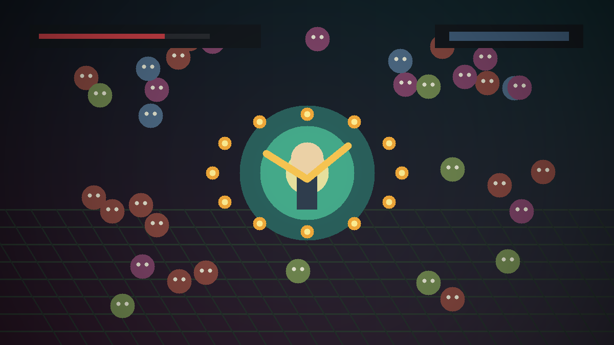
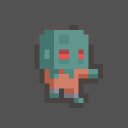
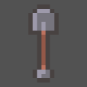
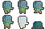
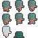
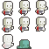

# VamGame



`VamGame`은 뱀파이어 서바이벌 스타일의 2D 액션 생존 게임입니다. 몰려오는 적을 피하면서 무기와 아이템을 성장시키는 구조로, Unity의 기본 게임 루프와 런타임 오브젝트 관리 흐름을 학습하며 제작했습니다.

## Project Summary

| Item | Description |
| --- | --- |
| Type | 2D action survival game |
| Role | 개인 학습 프로젝트 / 구현, 빌드, 문서화 |
| Engine | Unity |
| Language | C# |
| Build | Windows executable |
| Package | `games/vamgame/VamGame.unitypackage` |

## Core Gameplay

- 플레이어는 적을 피하면서 생존합니다.
- 적은 지속적으로 생성되고 플레이어를 추적합니다.
- 무기와 총알이 반복적으로 생성됩니다.
- 아이템과 장비를 통해 성장 루프를 구성합니다.
- HUD와 결과 화면으로 플레이 상태를 보여줍니다.

## Systems

| System | What It Does | Portfolio Point |
| --- | --- | --- |
| Player | 이동, 생존, 충돌 흐름 | Unity 입력/이동 처리와 생명 주기 구성 |
| Enemy | 적 생성, 추적, 피격 흐름 | 반복 생성되는 적의 상태 관리 |
| Weapon/Bullet | 공격과 투사체 처리 | 공격 주기와 런타임 오브젝트 생성 |
| Spawner | 적 등장 흐름 관리 | 난이도/웨이브 구조로 확장 가능한 구조 |
| PoolManager | 총알/적 재사용 | 성능을 고려한 오브젝트 풀링 |
| LevelUP/Item/Gear | 성장 요소 | 반복 플레이 동기와 선택 구조 |
| HUD/GameResult | 상태 표시와 결과 | 플레이 시작부터 종료까지 완성된 루프 |

## Asset Preview

Unity package에서 추출한 실제 에셋 프리뷰입니다.

| Enemy Prefab | Bullet 0 | Bullet 1 |
| --- | --- | --- |
|  |  |  |

| Enemy Sprite 0 | Enemy Sprite 1 | Enemy Sprite 2 |
| --- | --- | --- |
|  |  |  |

## Run

Windows에서 아래 실행 파일을 실행합니다.

```text
games/vamgame/Build/VamGame/vam.exe
```

## Included Files

```text
games/vamgame/
├── README.md
├── VamGame.unitypackage
└── Build/
    └── VamGame/
        ├── vam.exe
        └── vam_Data/
```

## Interview Talking Points

- 단순 캐릭터 이동 데모가 아니라 적, 무기, 아이템, UI, 결과 화면까지 연결된 게임 루프를 만들었습니다.
- 적과 투사체처럼 반복 생성되는 오브젝트는 풀링 구조로 관리했습니다.
- Unity package와 Windows build를 함께 보관해, 소스 에셋과 실행 결과물을 모두 확인할 수 있게 했습니다.

## What I Learned

- Unity에서 플레이어, 적, 무기, UI를 하나의 게임 흐름으로 연결하는 방식
- 반복 생성되는 오브젝트를 관리할 때 풀링 구조가 필요한 이유
- 게임 결과 화면까지 포함해 플레이 시작부터 종료까지 완성된 루프를 만드는 과정
