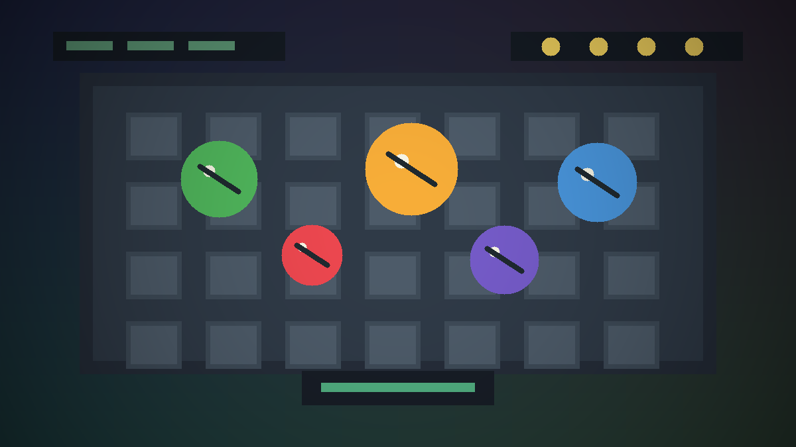

# subakgame



`subakgame`은 Unity로 제작한 Windows 실행 빌드 게임입니다. 현재 보관된 자료는 완성 빌드 형태이므로, 포트폴리오에서는 실행 가능한 결과물 중심으로 정리했습니다.

상세 포트폴리오 문서: [docs/subakgame.md](../../docs/subakgame.md)

## Project Summary / 프로젝트 요약

| Item | Description |
| --- | --- |
| Type | Unity Windows build |
| Role | 개인 학습 프로젝트 / 빌드, 정리, 문서화 |
| Engine | Unity |
| Language | C# |
| Build | Windows executable |

## Why I Included This / 포함한 이유

Unity 학습 과정에서 프로젝트를 실행 가능한 Windows 빌드로 완성한 결과물이기 때문에 포트폴리오 저장소에 포함했습니다.

현재는 원본 Unity 프로젝트보다 빌드 결과물이 중심이라, 실행 파일과 Data 폴더를 보존하고 실행 방법을 명확히 정리했습니다.

## Run / 실행

GitHub Release에서 ZIP을 내려받아 압축을 푼 뒤 아래 실행 파일을 실행합니다.

```text
subakgame/subakgame.exe
```

[subakgame Windows ZIP 다운로드](https://github.com/jiyoon99/unity-game-portfolio/releases/download/builds-2026.06/subakgame-windows.zip)

## Included Files / 포함 파일

- GitHub Release: Windows 실행 빌드

## Tech Stack / 기술 스택

- Unity
- C#
- Windows Build

## Project Structure / 프로젝트 구조

```text
subakgame/
└── README.md
```

## Portfolio Summary / 포트폴리오 요약

Unity 학습 과정에서 완성 빌드까지 만들어 본 게임 프로젝트입니다. 실행 파일과 Unity Data 폴더를 포함하고 있어 Windows 환경에서 바로 플레이할 수 있습니다.

## What I Learned / 배운 점

- Unity 프로젝트를 Windows 실행 빌드로 내보내는 과정
- 실행 파일과 Data 폴더가 함께 있어야 Unity 빌드가 동작한다는 점
- 포트폴리오에는 빌드 결과물뿐 아니라 스크린샷과 플레이 설명이 필요하다는 점

## To Improve / 개선할 점

- 플레이 화면 스크린샷 추가
- 게임 규칙과 조작법 보강
- 가능하면 원본 Unity 프로젝트 또는 `.unitypackage` 추가
